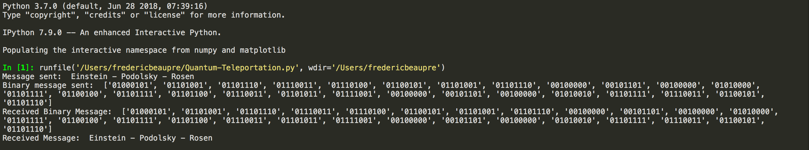

# Quantum-Teleportation
## Einstein-Podolsky-Rosen(EPR) Paradox
Consider a spin 0 boson which decays into two fermions. The initial system being a spin 0 system, the system resulting from the decay must have total spin 0 as well, hence one fermion must have spin +1/2 and the other, spin -1/2. Now imagine we shoot the fermions to opposite ends of the galaxy, and we travel along with one of them. After a long while, we measure our fermion's spin and thus collapse its superposed state into a definite spin eigenstate. Say we measure that state to be +1/2. In doing so, we instantly know what the spin of the other fermion on the other side of the galaxy is, it's -1/2. This information has obviously travelled faster than the speed of light, and this violates causality. We call this 'quantum entanglement', or 'quantum teleportation'. This constitutes the EPR paradox.  
I have here reproduced this quantum teleportation using entangled quantum bits in projectQ on a normal CPU. 
## Output

